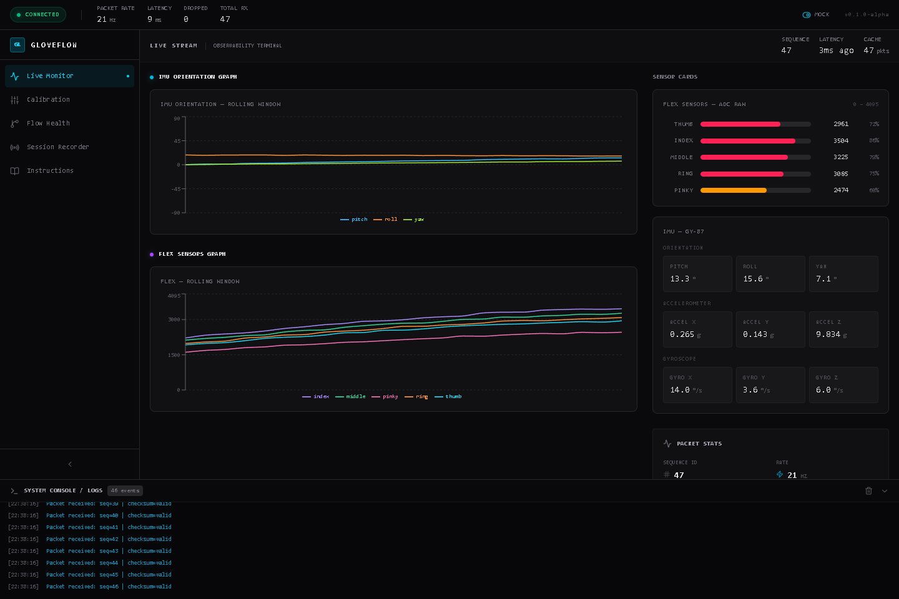
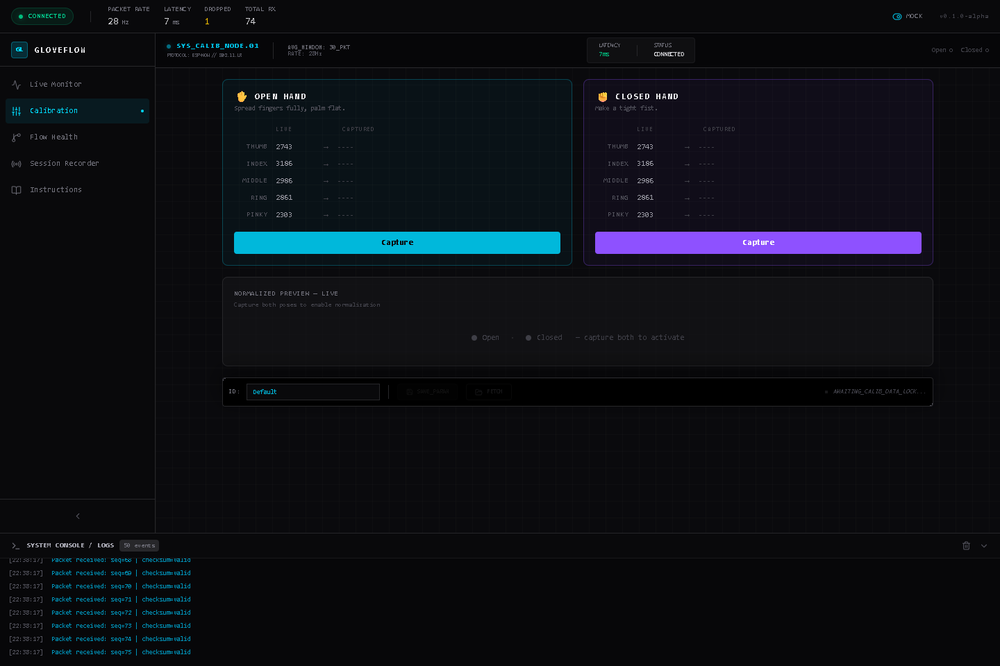
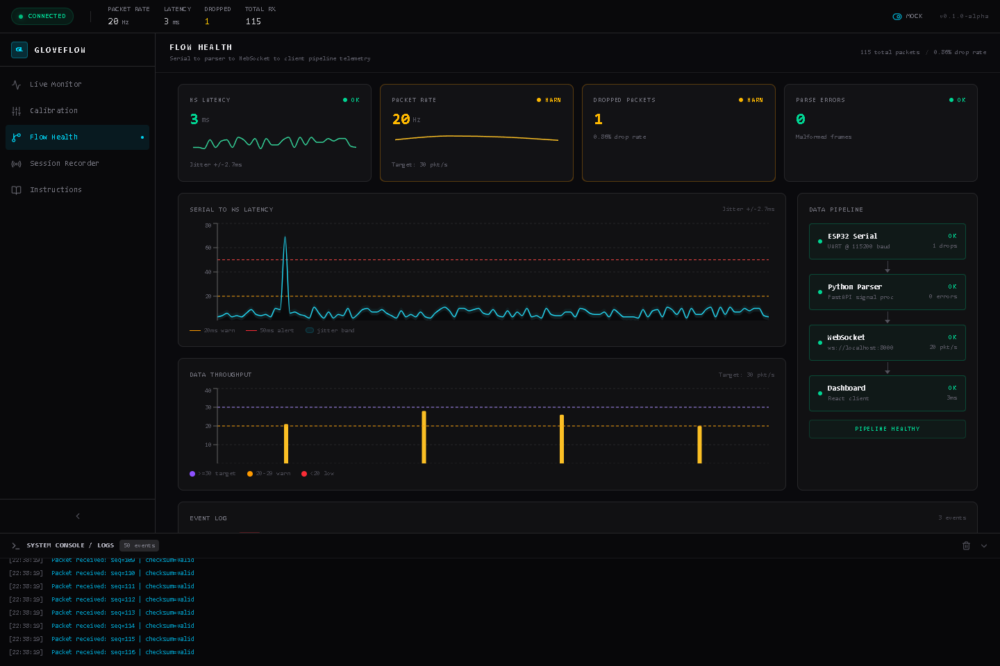
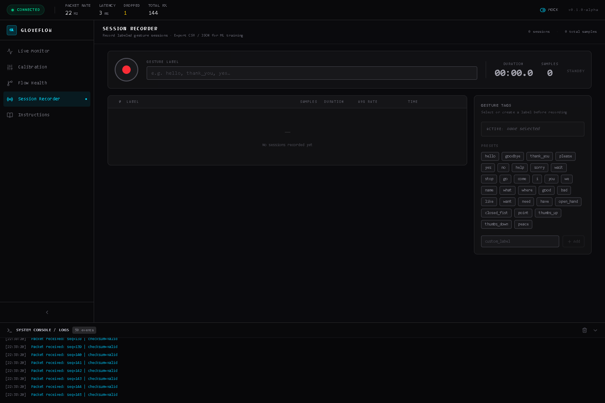
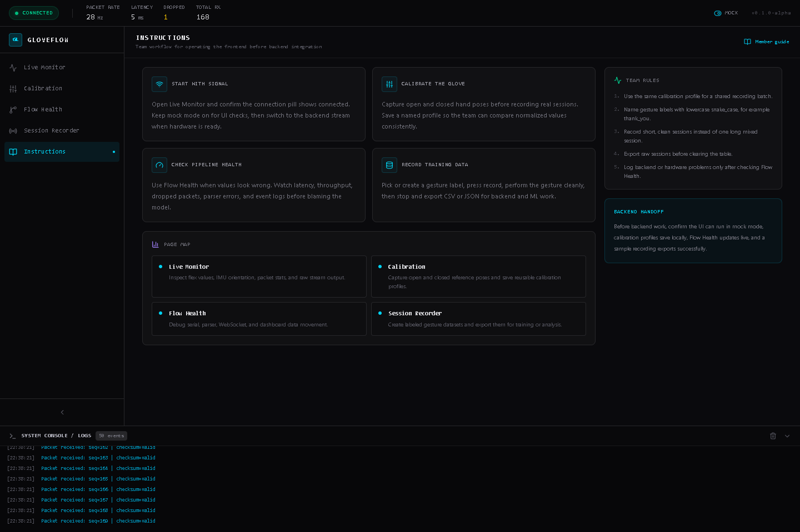

# Flowly

Flowly is a glove telemetry dashboard for monitoring flex sensors, IMU movement, pipeline health, calibration state, and labeled gesture recording. The frontend currently runs with mock sensor data so the team can validate workflows before backend and hardware integration.

## Frontend Pages

### Live Monitor

Use this page to inspect the current sensor stream, packet stats, flex sensor charts, IMU orientation, and raw packet output.



### Calibration

Use this page to capture open-hand and closed-hand reference values, preview normalized flex values, and save reusable calibration profiles.



### Flow Health

Use this page to debug the data pipeline. It tracks WebSocket latency, packet throughput, dropped packets, parser errors, jitter, and recent pipeline events.



### Session Recorder

Use this page to record labeled gesture sessions and export datasets as CSV or JSON for later backend and ML work.



### Instructions

Use this page as the in-app guide for new team members. It explains the recommended workflow before backend integration.



## How To Run

```bash
cd frontend
npm install
npm run dev
```

Open the local URL printed by Vite, usually:

```text
http://localhost:5173
```

For a production build:

```bash
cd frontend
npm run build
```

## Team Workflow

1. Open **Live Monitor** and confirm the app is receiving mock or real packets.
2. Open **Calibration** and capture open and closed hand poses before recording training data.
3. Open **Flow Health** if sensor values look wrong or the stream becomes unstable.
4. Open **Session Recorder**, choose a gesture label, record a clean sample, then export CSV or JSON.
5. Open **Instructions** when onboarding another member or checking the agreed frontend workflow.

## Recording Rules

- Use lowercase snake_case gesture labels, for example `thank_you`.
- Record short, clean sessions instead of one long mixed session.
- Use the same calibration profile for one shared dataset batch.
- Export sessions before clearing the recorder table.
- Check Flow Health before reporting backend or hardware stream issues.

## Current Status

- Frontend shell, navigation, and pages are wired.
- Mock telemetry is available for frontend testing.
- Session recording exports CSV and JSON from browser memory.
- Backend integration is the next build stage.
